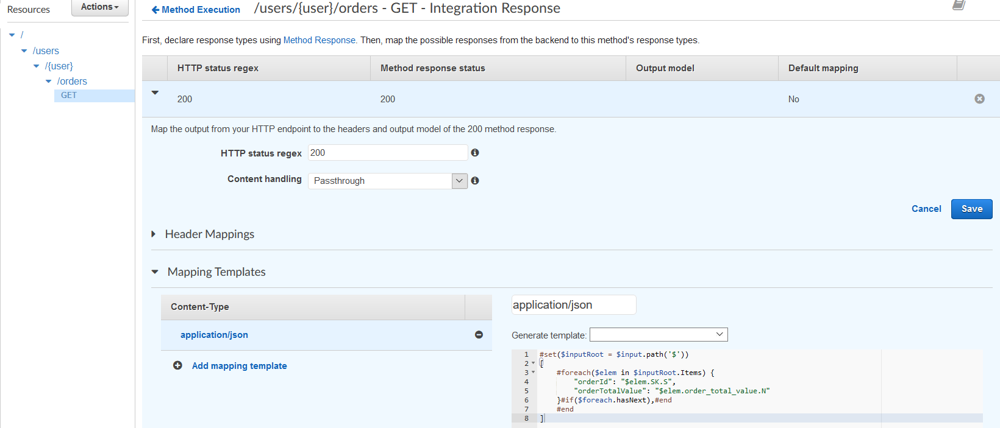
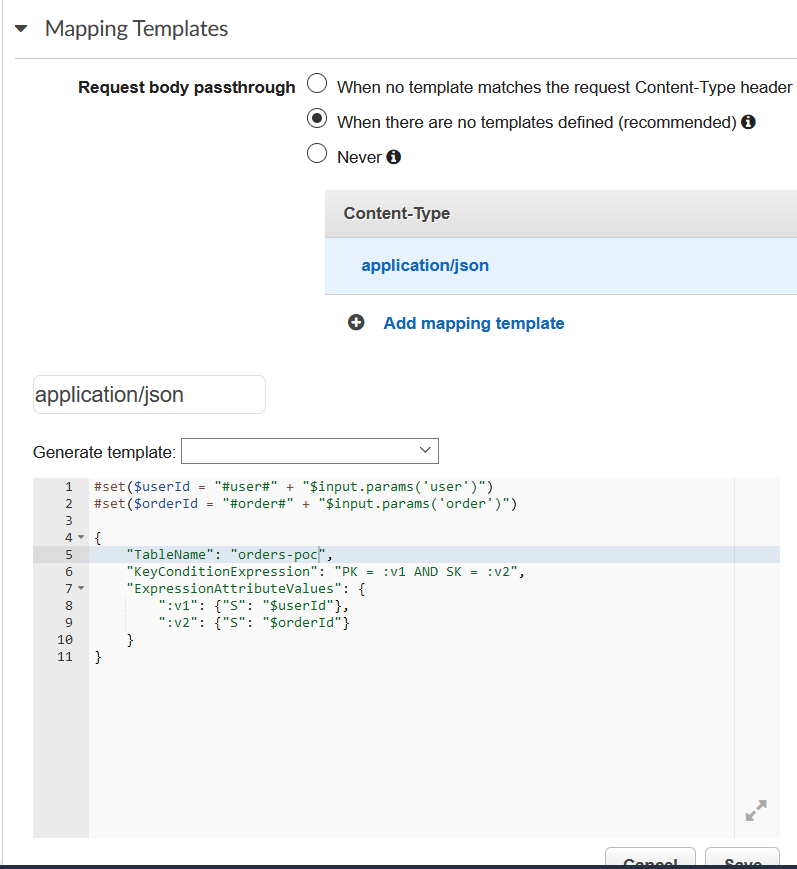
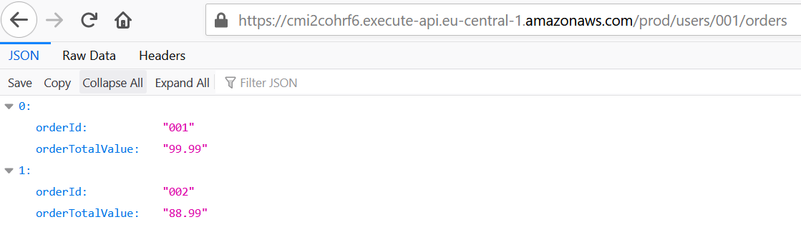

# AWS API-Gateway + DynamoDB (Without Lambda)

## Project Description

The project / proof of concept showcases a simple way to use AWS DynamoDB directly from AWS API Gateway. The proof of concept consists of a DynamoDB, API Gateway and the necessary IAM Roles and IAM Permissions.

### The Application

The Proof of Concept is a Rest API consists of 2 different routes, these routes returns dataset(s) from DynamoDB

### Routes

|route|description|response|
|---|---|---|
|`/users/<user>/orders`|Return the specified user orders|response-1|
|`/users/<user>/orders/<order>`|Return the specified user specified order|response-2|

#### response-1
```js
[
    {
    "ordeId": "<some-id>",
    "orderTotalValue": "<some-total-value"
    },
    {
    "ordeId": "<some-id>",
    "orderTotalValue": "<some-total-value"
    }
]
```

#### response-2
```js
{
  "ordeId": "<some-id>",
  "orderTotalValue": "<some-total-value"
}
```

### DynamoDB Data Model
|Partition Key|Sort Key|Attribute|
|---|---|---|
|`PK`|`SK`|`order-total-value`|

### Data record example
|`PK`|`SK`|`order-total-value`|
|---|---|---|
|#user#001|#order#001|97.99|
|#user#002|#order#002|919.99|
|#user#002|#order#003|959.99|
|#user#001|#order#004|199.99|
|#user#003|#order#005|9.99|

## Building the POC from the AWS Console

### Creating the DynamoDB Table

- Go to DynamoDB and Find the Create Table option
- Have "PK" as the Partition Key and "SK" as the Sort Key, and with the defaults create the table
- Insert some mock data into the table with an extra attribute called "order-total-value" and type "number"

Creating the Table 1


&nbsp;

Creating the Table 2


&nbsp;

Inserting some items


&nbsp;

Available Records


&nbsp;

### Creating the necessary Policy and IAM Role for the API Gateway routes
In order the API Gateway AWS resource integration setup would send a successful request to the DynamoDB table, we need to provide a so called "Execution Role" within the route and method Integration Request.

The only permission we want to add to the API-Gateway is to `Query` records

First we are going to set up an IAM Policy, which will be attached to a custom IAM Role. (In overall It might would be better if we won't reuse the same role within the 2 different route)

#### Creating the IAM Policy
- Go to IAM/policies and find the Create Policy button


- Next, Select The DynamoDB service, and select only the Query option, inside the Action/Access Level/Read Tab,


- Next, In the Resources Tab, selecte the already created DynamoDB "arn". (If you don't know how to get, just go back to the DynamoDB and select your table, and it would provide the arn)
 
 
- Finish the Process with, naming and reviewing the Policy settings.
 
 
 
 #### Creating the IAM Role
 - After you have the right policy with the DynamoDB Query capability, Go to the Roles tab inside IAM, and press create role, and select the API-Gateway default option
 
 
 - Then go with the default policy
 
 
 - Optionally you can add tags to it
 
 
 - Name it, review it, create it
 
 
 - After creation, go find and click on it
 
 
 - You will see the summary of the policy, go with the attach policy button
 
 
 - Find the policy that you have just created regarding the DynamoDB Query and attach it
 
 
 - Finally, in the role summary you will see the currently attached policy as a managed policy
 
 
 ### Setting up the REST API
 Setting up the REST API might take a couple more minutes setting up the application REST API than the provisioning a DynamoDB table or Creating the Role.
 
 - First Go to the AWS API Gateway tab and Create a new REST API type API, at the current moment of time, the HTTP API does not support custom service integrations
 
 
 
 
 - Then, give a `name` to the API and let the `endpoint type` field to be regional
 
 
 - At this point the `'/'` resource is available, we need to create the paths and methods to reflect our plan to have `/users/<user>/orders` and `/users/<user>/orders/<order>` routes with `GET` http method
 - First we are going to set up the `/users/<user>/orders` `GET` method by creating a new resource named `users` under the basepath, and `{user}` under the `users`, then `orders` under the `/users/<user>/`.
 
 
 
 
 
 
 
 
 
 
 - Then, we need to add the `GET`  method
 
 
 - Setting up the method we have to go through the following
    - Set the `integration Type` to `AWS Service`
    - Set up your desired `region`
    - The `AWS Service` in our case is `DynamoDB`
    - The `HTTP Method` is `POST`, because by default the interaction with DynamoDB is HTTP POST request.
    - We specify the `Action Name` to be `Query`
    - Here you have to provide the `Execution Role`, which is the same IAM Role that we have created before
 
 
 - A new window will pop up, where you can oversee the resource, method execution context, in our case you can see how the request comes from the client to DynamoDB and goes as a response back to the client.
 
 
 - Next is the most confusing part, setting up the `Integration Request` and `Integration Response`
 - First Click to the `Integration Request` from the previous view, and go to the bottom of the screen to select the mapping templates
 - Here you have to specify the template type, which is `application/json`, universally with this feature AWS uses the template language called Apache Velocity
 - use the following code here
 ```text
#set($userId = "#user#" + "$input.params('user')")

{
    "TableName": "orders-poc",
    "KeyConditionExpression": "PK = :v1",
    "ExpressionAttributeValues": {
        ":v1": {"S": "$userId"}
    }
}
```
- Here the code sets the user ID from the Path parameter, and for future reference the "$input.params(`'user'`) here is matching with the resource /users/`<user>`/orders
- The request body is between the `{...}`, and its a standard DynamoDB Query with the additional template language syntax
- [Apache Velocity](https://velocity.apache.org/engine/1.7/user-guide.html)
- [The AWS DynamoDB SDK](https://docs.aws.amazon.com/amazondynamodb/latest/APIReference/API_Operations_Amazon_DynamoDB.html)


- After saving the `Integration Request`, go test you method, there is a test button on the `Method Resource` screen, complete the `{user}` input with an existing user id, and press the `test`
- If you did everything right, you would meet a similar result


- Go to the `Integration Response` option, and need to map the templates here as well with the following,
```text
#set($inputRoot = $input.path('$'))
[
    #foreach($elem in $inputRoot.Items) {
        "orderId": "$elem.SK.S.split('#order#')[1]",
        "orderTotalValue": "$elem.order_total_value.N"
    }#if($foreach.hasNext),#end
    #end
]
```


- After saving the `Integration Response`, test your function again from the available test screen, and you should get similar results, just with a proper response mapping


Almost there! But we have to go through the mapping process again with the "specified" orders

- First, create a new resource called `{order}` under the `/users/<user>/orders`, and create a method called `GET`


- Then, map the `Integration Request` and `Integration Response` in this resource the same way, we did before with the `orders`
    - Integration Request:
```text
#set($userId = "#user#" + "$input.params('user')")
#set($orderId = "#order#" + "$input.params('order')")

{
    "TableName": "orders-poc",
    "KeyConditionExpression": "PK = :v1 AND SK = :v2",
    "ExpressionAttributeValues": {
        ":v1": {"S": "$userId"},
        ":v2": {"S": "$orderId"}
    }
}
```
   - Integration Response:
```text
#set($inputRoot = $input.path('$'))
{
    "orderId": "$inputRoot.Items[0].SK.S.split('#order#')[1]",
    "orderTotalValue": $inputRoot.Items[0].order_total_value.N
}
```
- The Integraton Request


- The Integraton Request test 


- The Integration Response


- The Integration Response test


- Almost there!!! We need to deploy our REST API,


- After you deployed, go to the browser and copy and paste the same URL that the deployment would provide you!, and you should see a similar result than us.



- Usually if you know, that you want to enable `CORS`, you should do it after creating the resources and methods, by clicking on the `Resource` and `Action` Button, you would see an option to `Enable CORS`, these feature take care of the CORS business, but you can have custom attributes as well.


- Test it and you can see the `Access-Controll-Allow-Origin` header on the request
 

## Building the Project with Cloudformation Template

The attached template will create
- DynamoDB Table
- Policy to Query the Table
- Role to use the policy above from the API Gateway
- API Gateway
    - proper resources
    - proper methods
    - deployment
    - stage

If you want to use the template use the AWS Cloudformation CLI, locate into its directory and run 
`aws cloudformation validate-template --template-body file://cloudformation.yaml` to validate the template, if you find acceptable the result run
`aws cloudformation create-stack --stack-name myteststack --template-body file://cloudformation.yaml --capabilities CAPABILITY_NAMED_IAM`

You can check the process within the AWS console CloudFormation tab, if its finished, put some data to your DynamoDB table, and check out what is your API endpoint, and try to query it.

The template:
```yml
AWSTemplateFormatVersion: 2010-09-09
Resources:
  DynamoDBTable:
    Type: AWS::DynamoDB::Table
    Properties:
      TableName: "orders-poc-table"
      AttributeDefinitions:
        - AttributeName: PK
          AttributeType: S
        - AttributeName: SK
          AttributeType: S
      KeySchema: 
        - AttributeName: PK
          KeyType: "HASH"
        - AttributeName: SK
          KeyType: "RANGE"
      ProvisionedThroughput:
        ReadCapacityUnits: 5
        WriteCapacityUnits: 5

  QueryRole:
    Type: AWS::IAM::Role
    Properties: 
      AssumeRolePolicyDocument:
        Version: 2012-10-17
        Statement:
          - Effect: Allow
            Principal:
              Service:
              -  apigateway.amazonaws.com
            Action:
              - 'sts:AssumeRole'
      Description: A temporary universal role to query DynamoDB from the API Gateway
      ManagedPolicyArns: 
        - arn:aws:iam::aws:policy/service-role/AmazonAPIGatewayPushToCloudWatchLogs
      RoleName: poc-query-role

  QueryPolicy:
    Type: AWS::IAM::Policy
    Properties: 
      PolicyDocument:
        Version: 2012-10-17
        Statement:
          - Effect: Allow
            Action:
              - 'dynamodb:Query'
            Resource: !GetAtt DynamoDBTable.Arn
      PolicyName: QueryDynamoDB
      Roles: 
        - !Ref QueryRole

  APIGateway:
    Type: 'AWS::ApiGateway::RestApi'
    Properties:
      Description: RESTAPI for the POC
      Name: "poc-rest-api"
      Parameters:
        endpointConfigurationTypes: REGIONAL
  
  APIGatewayUsersResource:
    Type: 'AWS::ApiGateway::Resource'
    Properties:
      RestApiId: !Ref APIGateway
      ParentId: !GetAtt 
        - APIGateway
        - RootResourceId
      PathPart: users

  APIGatewayUserResource:
    Type: 'AWS::ApiGateway::Resource'
    Properties:
      RestApiId: !Ref APIGateway
      ParentId: !Ref APIGatewayUsersResource
      PathPart: '{user}'

  APIGatewayOrdersResource:
    Type: 'AWS::ApiGateway::Resource'
    Properties:
      RestApiId: !Ref APIGateway
      ParentId: !Ref APIGatewayUserResource
      PathPart: orders

  APIGatewayOrderResource:
    Type: 'AWS::ApiGateway::Resource'
    Properties:
      RestApiId: !Ref APIGateway
      ParentId: !Ref APIGatewayOrdersResource
      PathPart: '{order}'

  MethodGetOrders:
    Type: AWS::ApiGateway::Method
    Properties: 
      HttpMethod: GET
      AuthorizationType: NONE
      Integration:
        Credentials: !GetAtt QueryRole.Arn
        IntegrationHttpMethod: POST
        IntegrationResponses:
        - ResponseTemplates:
            application/json: |
              #set($inputRoot = $input.path('$'))
              [
                  #foreach($elem in $inputRoot.Items) {
                      "orderId": "$elem.SK.S.split('#order#')[1]",
                      "orderTotalValue": "$elem.order_total_value.N"
                  }#if($foreach.hasNext),#end
                  #end
              ]
          StatusCode: 200
        PassthroughBehavior: WHEN_NO_TEMPLATES
        RequestTemplates: 
          application/json: "#set($userId = \"#user#\" + \"$input.params('user')\")\n{\"TableName\":\"orders-poc-table\",\"KeyConditionExpression\":\"PK=:v1\",\"ExpressionAttributeValues\":{\":v1\":{\"S\":\"$userId\"}}}}"
        Type: AWS
        Uri: !Sub "arn:aws:apigateway:${AWS::Region}:dynamodb:action/Query"
      MethodResponses:
        - ResponseModels:
            application/json: Empty
          StatusCode: 200
      ResourceId: !Ref APIGatewayOrdersResource
      RestApiId: !Ref APIGateway

  MethodGetOrder:
    Type: AWS::ApiGateway::Method
    Properties: 
      HttpMethod: GET
      AuthorizationType: NONE
      Integration:
        Credentials: !GetAtt QueryRole.Arn
        IntegrationHttpMethod: POST
        IntegrationResponses:
        - ResponseTemplates:
            application/json: |
              #set($inputRoot = $input.path('$'))
              {
                  "orderId": "$inputRoot.Items[0].SK.S.split('#order#')[1]",
                  "orderTotalValue": $inputRoot.Items[0].order_total_value.N
              }
          StatusCode: 200
        PassthroughBehavior: WHEN_NO_TEMPLATES
        RequestTemplates: 
          application/json: |
            #set($userId = "#user#" + "$input.params('user')")
            #set($orderId = "#order#" + "$input.params('order')")
            {
                "TableName": "orders-poc-table",
                "KeyConditionExpression": "PK = :v1 AND SK = :v2",
                "ExpressionAttributeValues": {
                    ":v1": {"S": "$userId"},
                    ":v2": {"S": "$orderId"}
                }
            }
        Type: AWS
        Uri: !Sub "arn:aws:apigateway:${AWS::Region}:dynamodb:action/Query"
      MethodResponses:
        - ResponseModels:
            application/json: Empty
          StatusCode: 200
      ResourceId: !Ref APIGatewayOrderResource
      RestApiId: !Ref APIGateway

  APIGatewayDeployment:
    Type: AWS::ApiGateway::Deployment
    DependsOn:
      - APIGateway
      - MethodGetOrders
      - MethodGetOrder
    Properties:
      RestApiId: !Ref APIGateway
      Description: POC Deployment

  APIGatewayStage:
    Type: AWS::ApiGateway::Stage
    Properties:
      DeploymentId: !Ref APIGatewayDeployment
      Description: POC stage
      RestApiId: !Ref APIGateway
      StageName: test
```